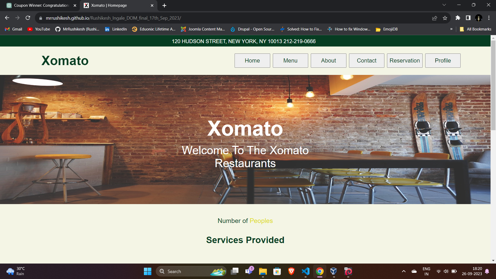
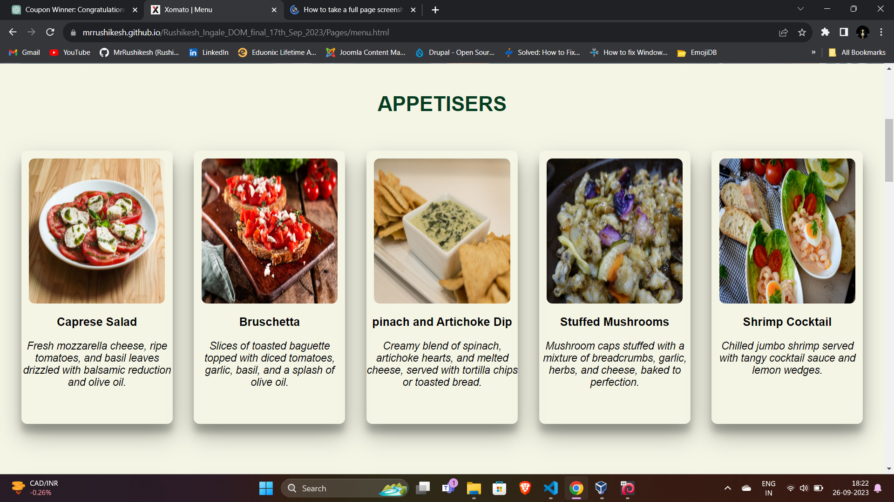
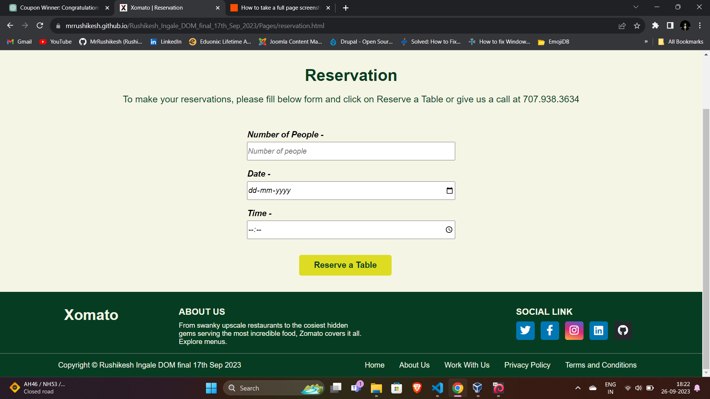
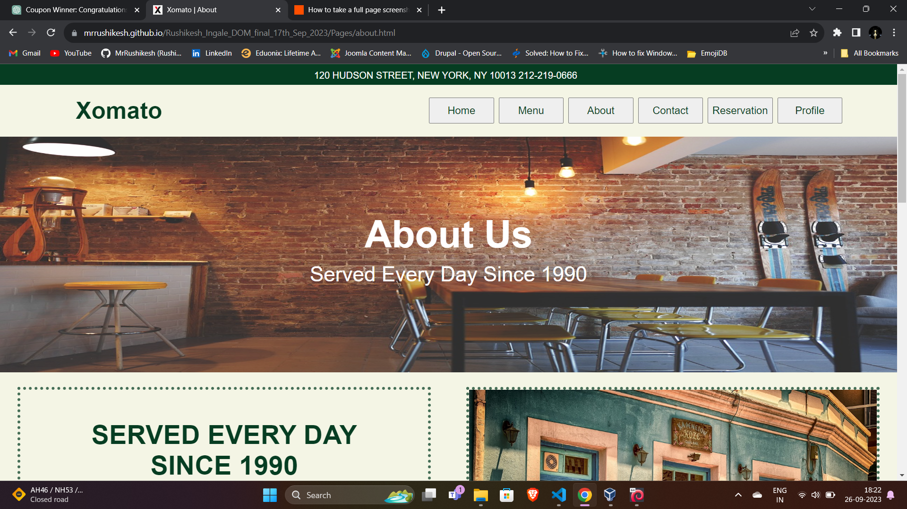
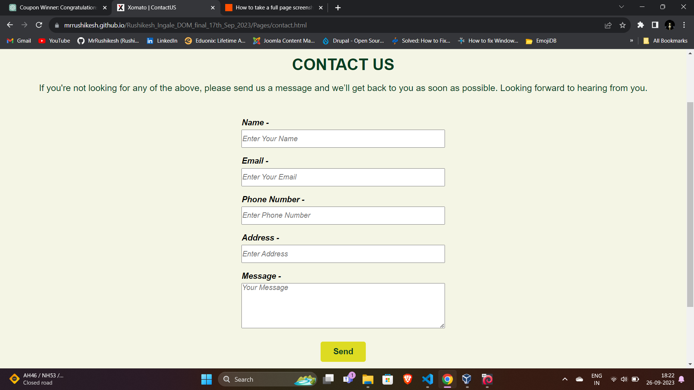
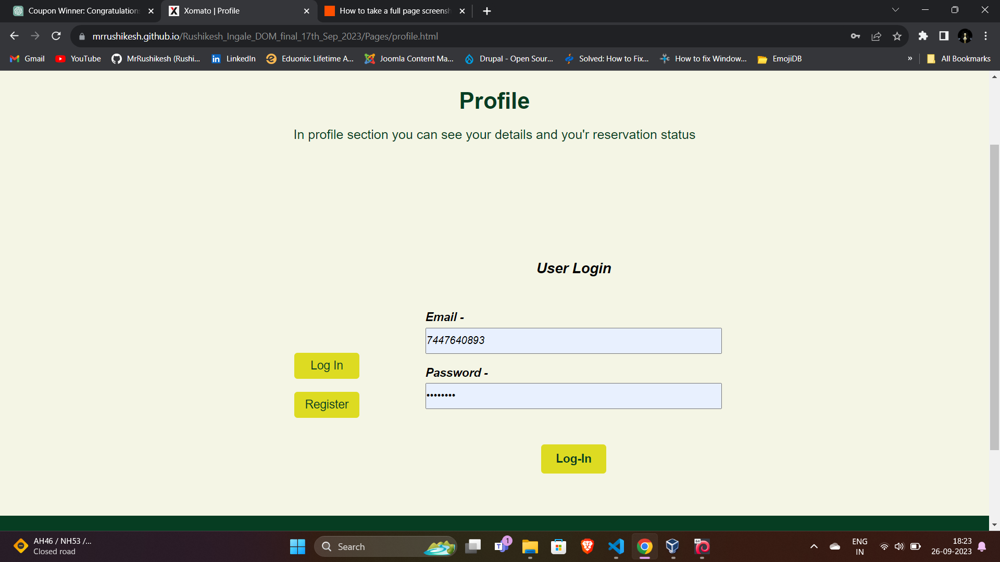

# Restaurant Reservation System Documentation

## Introduction -: 

- Welcome to our restaurant website project, a delightful online platform designed to showcase our restaurant's offerings, streamline reservations, and provide an immersive glimpse into our culinary world. This project marries technology with the art of gastronomy, offering a seamless and engaging experience for our customers and potential visitors.

## Project Overview -: 

- The Restaurant Reservation System is a web application that allows users to explore a restaurant's offerings, make reservations, and contact the restaurant. This documentation provides an overview of the project, its features, and the technologies used.

## Project Description

- The Restaurant Reservation System is a web application that consists of several main sections, including the Home Page, Menu Page, Reservations Page, About Us Page, and Contact Us Page. Additionally, it features user authentication functionality with a Signup page, Login page, and User Profile page.

## Features and Functionality

### Home Page  -: 

- A navigation bar for easy navigation.
- A section describing the restaurant.
- Showcase of the restaurant's unique selling points, such as images and customer testimonials.

### Menu Page -: 

- Display of dishes through cards with images, names, and descriptions.
- Categorization of dishes into various types (e.g., Appetisers, Main Course, Desserts).

### Reservations Page -: 

- A reservation form for users to select a date and time.
- Availability check and reservation confirmation.
- User reservation storage and display on the User Profile page.

### About Us Page -: 

- Section with the restaurant's history.
- Images of the restaurant.
- Information about staff and chefs.

 

### Contact Us Page -: 

- A detailed inquiry form, collecting user information like address, email, and phone number.
- User Authentication System

### Signup page using the Reqres API for user registration. -: 
- Login page using the Reqres API for user login.
- User Profile page displaying user information and past reservations using API for user data.

## APIs Used -:

- Authentication: Reqres API for user registration and login. Please note that it's a simulation and doesn't provide real authentication functionality.
- User Data: Continue using the Reqres API for user data simulation.
- Restaurant Data: Consider using a mock data API service like Mockaroo for creating custom mock data for the restaurant and menu.

## Project Structure -: 

- The project follows a modular structure, separating HTML, CSS, and JavaScript files for each page. Properly organized directories ensure maintainability and scalability.

## Technologies Used -: 

- List the technologies and tools used in the project, such as HTML, CSS, JavaScript, etc.

## Responsiveness -: 

- All pages in the project are designed to be fully responsive, ensuring a consistent and user-friendly experience on various screen sizes and devices.

## Challenges and Considerations

- Discuss any challenges faced during development and considerations for future enhancements or improvements.

## Conclusion and Future Enhancements

Summarize the project's key features and benefits. Mention potential areas for future enhancements, such as adding real authentication and integrating with a real restaurant database.

## Live Link -: 
<a href="https://mrrushikesh.github.io/Rushikesh_Ingale_DOM_final_22th_Oct_2023/Pages/profile.html">Click Here</a>

## How to Start -: 

- step 1 -: Install json-server. 
    `npm install json-server -g`

- Step 2 -: Run json-server on port number 5000. 
    `npm json-server data.json --port=5000`

- Step 3 -: Click on index.html